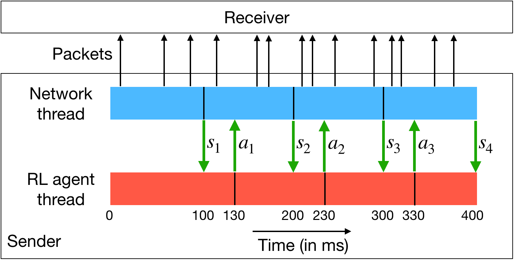
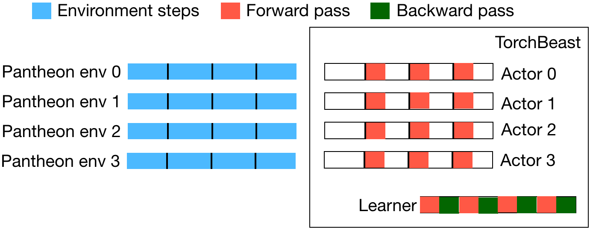

# mvfst-rl
`mvfst-rl` is a framework for network congestion control in the QUIC transport protocol that leverages state-of-the-art in asynchronous Reinforcement Learning training with off-policy correction. It's built upon the following components:
1. [mvfst](https://github.com/facebookincubator/mvfst), an implementation of the IETF QUIC transport protocol.
2. [torchbeast](https://github.com/facebookresearch/torchbeast), a PyTorch implementation of asynchronous distributed deeep RL.
3. [Pantheon](https://github.com/StanfordSNR/pantheon), a set of calibrated network emulators.

### Asynchronous RL Agent



### Training Architecture



For more details, please refer to our [paper](https://arxiv.org/abs/1910.03552).

## Building mvfst-rl

### Ubuntu 16+

Pantheon requires Python 2 while `mvfst-rl` training requires Python 3.7+. The recommended setup is to explicitly use python2/python3 commands.

For building with training support, it's recommended to have a conda environment first:
```
conda create -n mvfst-rl python=3.7 -y && conda activate mvfst-rl
./setup.sh
```

For building `mvfst-rl` in test-only or deployment mode, run the following script. This allows you to run a trained model exported via TorchScript purely in C++.
```
./setup.sh --inference
```

## Training
Training can be run as follows:
```
python3 -m train.train \
  --mode=train \
  --base_logdir=/tmp/logs \
  --total_steps=1000000 \
  --learning_rate=0.00001 \
  --num_actors=40 \
  --cc_env_history_size=20
```

The above starts 40 Pantheon instances in parallel that communicate with the torchbeast actors via RPC. To see the full list of training parameters, run `python3 -m train.train --help`.

## Evaluation

For running test via RPC for policy lookup, use `--mode=test` as follows:
```
python3 -m train.train \
  --mode=test \
  --base_logdir=/tmp/logs \
  --cc_env_history_size=20
```

The above takes the `checkpoint.tar` file in `/tmp/logs` and tests the RL agent on all emulated Panthoen environments.

To export a trained model via TorchScript, run the above command with `--mode=trace`. This outputs a traced model file within `--base_logdir`. Testing with local inference in C++ (without RPC) can then be run with `--mode=test_local`.

## Contributing
We would love to have you contribute to `mvfst-rl` or use it for your research. See the [CONTRIBUTING](CONTRIBUTING.md) file for how to help out.

## License
mvfst-rl is licensed under the CC-BY-NC 4.0 license, as found in the LICENSE file.
